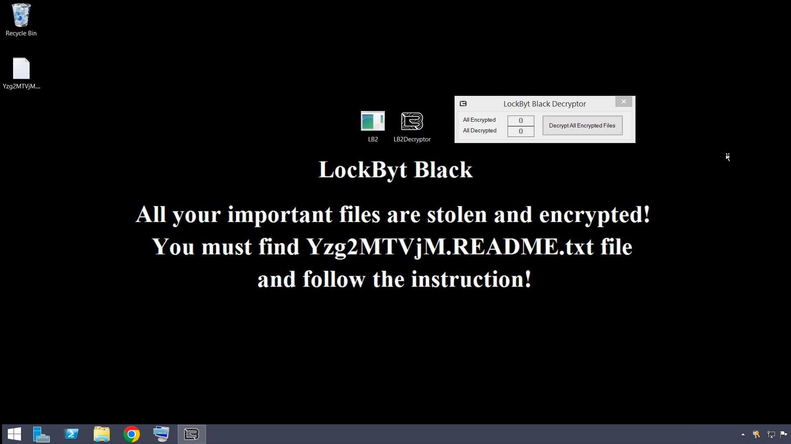

# LockBytBlack
LockByt Ransomware Builder

## Warning

Do **NOT** Expect this to be Fast as LockBit, Due to Limitations of .NET 4 (C#) this is the best i could do,LockBit is written in a Native Language (C) it is **DEFINITELY** faster Than LockByt.

## Features
- **Algorithm Switching**
- **XChaCha/XSalsa with Configurable Rounds** (8/12/20)
- **RSA with Configurable Bits** (1024/2048/3072/4096)
- **Backup Wipe**
- **Built In Stealer** (StealByt, Steals 500MB of Important files,Browser Files,Application File's, Harvest-Now-Decrypt-Later)
- **Print Ransom Note on All Printers**
- **Better Parallel Tuner**
- **Multi Threaded Encryption**
- **Fast Encryption**
- **PEM & XML RSA Keys**
- **Change Icon of Encrypted Files** (LockBit 3.0 Black icon)
- **UAC Bypass** (fodhelper,cmstp,computerdefaults)
- **Clear Logs**
- **Defender Killer** (only for Windows Defender, Requires Administrator privileges)
- **Wallpaper** (Dynamic,1:1 of LB3's Wallpaper)
- **Encrypt Network** (Network Drives, MountPoints)
- **Encrypt Local Drives** (Fixed,Removable drives)
- **Open Ransom Note**
- **Melt**
- **Mutex**
- **IOCP Async I/O**
- **Excluded Languages** (example: ru-RU,tr-TR,uk-UA)
- **List** (List to process hardcoded list)

## list Configuration

Format: action:target

Actions (comma separated, no spaces):

- kill:name           Kill process by name

- killtree:name       Kill process and children

- killpid:pid         Kill process by PID

- service:name        Stop Windows service

- disableservice:name Disable Windows service

- deleteservice:name  Delete Windows service

- uninstall:name      Uninstall application

- delete:path         Delete file

- rmdir:path          Delete directory

- regdelete:key       Delete registry key

- regdelval:key:value Delete registry value

- block:domain        Block domain in hosts file

- killwdprocesses     Kill Windows Defender Processes

Example:
kill:notepad,killtree:chrome,block:https://virustotal.com,killwdprocesses

## Security
- Random IV Per File
- RNG for Key & IV generation's
- XChaCha/XSalsa IV 24-Bytes (192-Bits)

## Summary
Fast And Secure,
I can not determine the exact Encryption speed Due to it depending on the environment
(Victim Hardware,Threads)

## Victim Machine Visual

## Educational Purposes Only

This repository and its contents are intended solely for academic research, educational purposes, and authorized security analysis. 

### Terms of Use

* **Strictly Educational:** The source code, concepts, and methodologies demonstrated in this repository are designed to help developers and security researchers understand binary structure, metadata manipulation, and assembly patching mechanics.
* **No Unauthorized Deployment:** The use of any concepts or artifacts derived from this project against systems without explicit, prior written authorization from the system owner is strictly prohibited.
* **No Liability:** This software is provided "as-is" without any express or implied warranty. Under no circumstances shall the author or contributors be liable for any direct, indirect, incidental, special, exemplary, or consequential damages, or legal repercussions arising from the use or misuse of this repository.
* **User Responsibility:** By downloading, cloning, or interacting with this repository, you assume full responsibility for your actions and compliance with all applicable local, national, and international laws.
